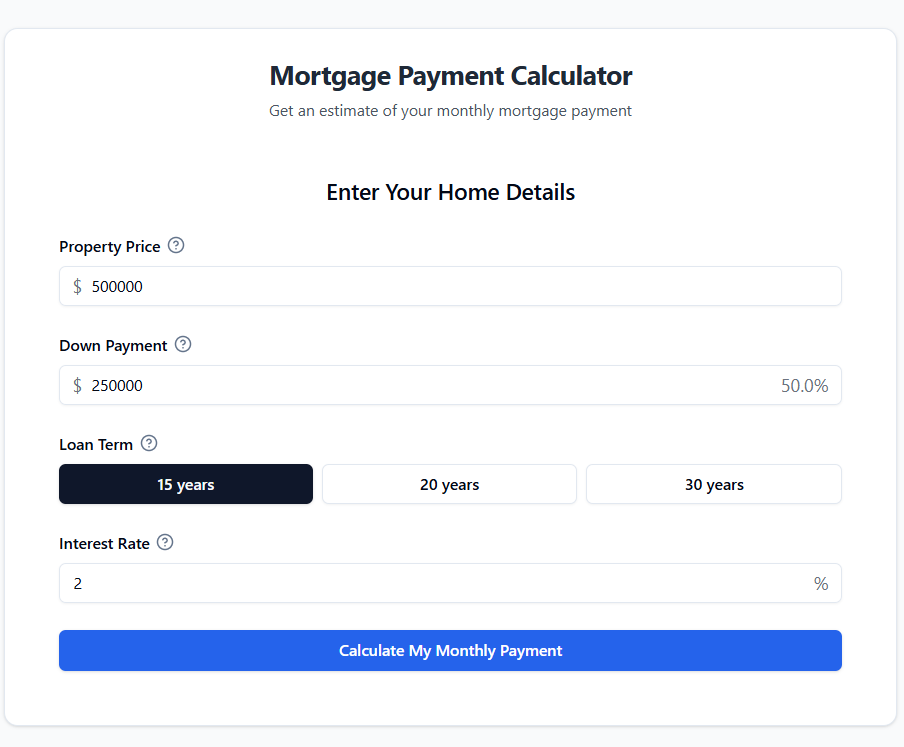

# Mortgage Calculator

A modern, responsive mortgage calculator built with React, TypeScript, and Tailwind CSS. This application helps users estimate monthly mortgage payments and analyze loan details for home purchases.



## Features

- **Mortgage Payment Calculation**: Calculate monthly payments based on property price, down payment, loan term, and interest rate
- **Payment Breakdown**: Visual breakdown of principal, interest, taxes, and insurance
- **Interactive Adjustments**: Real-time sliders to adjust values and see immediate results
- **Amortization Schedule**: Detailed year-by-year payment schedule with principal and interest breakdown
- **Responsive Design**: Works seamlessly on desktop and mobile devices
- **Form Validation**: Input validation with helpful error messages
- **Professional UI**: Clean, modern interface built with shadcn/ui components

## Tech Stack

- **Frontend**: React 18 + TypeScript
- **Build Tool**: Vite
- **Styling**: Tailwind CSS
- **UI Components**: shadcn/ui (Radix UI + Tailwind)
- **Icons**: Lucide React
- **Routing**: React Router
- **Form Handling**: React Hook Form + Zod validation

## Getting Started

### Prerequisites

- Node.js 18+ and npm

### Installation

1. Clone the repository:
```bash
git clone https://github.com/whoisorioki/mortgage_calculator.git
cd mortgage_calculator
```

2. Install dependencies:
```bash
npm install
```

3. Start the development server:
```bash
npm run dev
```

4. Open your browser and navigate to `http://localhost:5173`

## Available Scripts

- `npm run dev` - Start the development server
- `npm run build` - Build the application for production
- `npm run preview` - Preview the production build
- `npm run lint` - Run ESLint for code quality checks

## Project Structure

```
src/
├── components/
│   ├── home.tsx              # Main page component
│   ├── MortgageCalculator.tsx # Main calculator logic and state management
│   ├── InputForm.tsx         # Form for mortgage parameters input
│   ├── ResultsView.tsx       # Results display with charts and breakdown
│   └── ui/                   # Reusable UI components (shadcn/ui)
├── lib/
│   └── utils.ts              # Utility functions
├── App.tsx                   # Root application component
├── main.tsx                  # Application entry point
└── index.css                 # Global styles
```

## How It Works

1. **Input Phase**: Users enter mortgage parameters including:
   - Property price
   - Down payment amount
   - Loan term (years)
   - Interest rate

2. **Calculation**: The app calculates:
   - Monthly principal and interest payment using the standard mortgage formula
   - Estimated property taxes (1% annually)
   - Estimated insurance (0.5% annually)
   - Total monthly payment

3. **Results Phase**: Users can view:
   - Total monthly payment breakdown
   - Interactive pie chart of payment components
   - Adjustable sliders for real-time recalculation
   - Detailed amortization schedule

## Mortgage Calculation Formula

The monthly payment is calculated using the standard mortgage formula:

```
M = P * [r(1+r)^n] / [(1+r)^n - 1]
```

Where:
- M = Monthly payment
- P = Principal loan amount (property price - down payment)
- r = Monthly interest rate (annual rate / 12)
- n = Total number of payments (loan term * 12)

## Contributing

1. Fork the repository
2. Create a feature branch (`git checkout -b feature/your-feature`)
3. Commit your changes (`git commit -am 'Add some feature'`)
4. Push to the branch (`git push origin feature/your-feature`)
5. Open a Pull Request

## License

This project is open source and available under the [MIT License](LICENSE).
